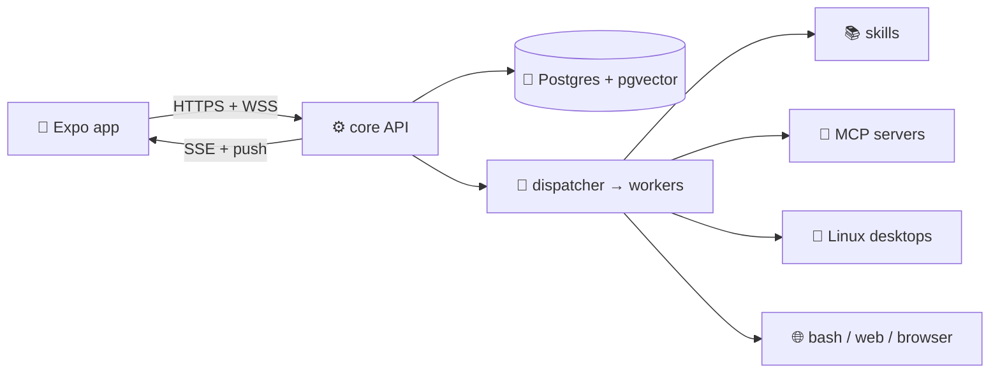

<div align="center">

# 🤖 nano-agents

**Your own Grok-style bot — self-hosted, with almost every feature.**
Chat from your phone. Agents team up, run workers, remember, schedule routines, use skills & MCP tools, drive a real Linux desktop you can watch.

[](LICENSE)
[](https://nodejs.org)
[](https://pnpm.io)
[](https://www.docker.com)
[](https://expo.dev)

[Quickstart](#-60-second-quickstart) · [Features](#-features) · [How it works](#-how-it-works) · [Setup](deploy/SETUP.md) · [Contributing](CONTRIBUTING.md)

</div>

> Drop a demo GIF here: `docs/demo.gif` — chat → worker → desktop takeover. PRs with screenshots welcome.

---

## Table of contents

- [⚡ 60-second quickstart](#-60-second-quickstart)
- [✨ Features](#-features)
- [🧠 How it works](#-how-it-works)
- [📱 Phone app](#-phone-app)
- [🖥️ Agent desktops](#️-agent-desktops)
- [🧩 Skills & MCP plugins](#-skills--mcp-plugins)
- [⏰ Routines & teams](#-routines--teams)
- [⚙️ Configuration](#️-configuration)
- [🧪 Develop](#-develop)
- [🗺️ Roadmap](#️-roadmap)
- [🤝 Contributing & Security](#-contributing--security)

---

## ⚡ 60-second quickstart

> Full tunnel + OAuth + VPS guide: [`deploy/SETUP.md`](deploy/SETUP.md)

```bash
git clone git@github.com:shoodoow/nano-agents.git && cd nano-agents
pnpm install
docker compose up -d postgres
pnpm db:migrate

cp apps/core/.env.example apps/core/.env       # fill secrets (never commit!)
cp apps/mobile/.env.example apps/mobile/.env   # EXPO_PUBLIC_CORE_URL=https://<your-host>

pnpm --filter core dev            # API on :3000
pnpm --filter mobile start:clear  # scan QR with Expo Go
```

<details>
<summary><b>Prerequisites (click to expand)</b></summary>

| Need | Why |
|------|-----|
| Node.js ≥ 22.13, pnpm 12.6 | monorepo build |
| Docker | Postgres + one Linux per account |
| `cloudflared` + domain | phone reaches your laptop/VPS without a static IP |
| Google OAuth client (Web) | sign-in, redirect `https://<host>/api/auth/callback/google` |
| Expo Go | run the app on a physical phone |

</details>

<details>
<summary><b>First 3 things to try</b></summary>

1. Hire an agent, open a room, `@mention` it — it replies, streams, and reacts.
2. Ask it to research something — a background **worker** does bash/web while chat stays snappy.
3. Open the agent's **desktop** from the phone, watch it work, take over input, hand back.

</details>

---

## ✨ Features

Think Grok bot, but yours — every message can trigger real work.

| Area | What you get |
|------|--------------|
| 💬 Chat | rooms, DMs & groups, streaming SSE, replies/quotes, emoji reactions, attachments (photos, files), rich blocks (markdown, code, tables, charts, polls, checklists, approvals, agent cards) |
| 👥 Teams | hire agents with name/role/personality/job, form groups, `@mention` wakes in order, subagents + cancellable background workers, auto-review of worker reports |
| 🧠 Memory | cited summaries, per-account & private facts, semantic recall, stable cache prefix, context-usage ring |
| 🛠️ Tools | bash/read/write as the agent Linux user, web fetch + readability, browser bridge, computer use, `read_skill`, `read_history`, todo lists |
| 🧩 Extensions | per-account **MCP** (HTTP Streamable) connectors with OAuth, `{slug}_{tool}` names, in-process `registerPluginTool`, trace plugins (`run.start` → `tool.call.finish` → `run.finish`) |
| ⏰ Routines | cron-like schedules claim **one** job via Postgres skip-lock and post through the same room turn as a person |
| 🖥️ Desktop | one Linux per account, private home per chat + `/shared`, Xvfb/x11vnc/noVNC on localhost, screenshot stream over WebSocket, takeover pause |
| 🔐 Auth | Better Auth + Google OAuth, sealed provider/MCP secrets, vault UI, short-lived screen tokens (no cookie sharing) |
| 📲 Mobile | roster, inbox, chat, approvals, plugins page, push via Expo (dev-build recommended), offline-friendly reconnect |
| 🤖 Models | OpenAI / Anthropic / xAI via AI SDK + OpenAI-compatible custom base URL + Vercel AI Gateway context-window resolution |

---

## 🧠 How it works



<details>
<summary><b>One message, step by step</b></summary>

```text
you @ana "research pricing, book nothing yet"
  → POST /messages → run slot claimed
  → dispatcher replies first ("On it — starting with pricing")
  → spawn_worker(research brief: goal, URL, method, proof)
  → worker: bash/web/read_skill → report to parent
  → parent reviews, send_message(result in 1–3 sentences)
  → events + SSE stream to every open phone
```

Dispatcher = voice only (`send_message`, reactions). Workers = hands (bash/web/desktop). Never the other way around.

Full engine doc: [`apps/core/src/turn/GUIDE.md`](apps/core/src/turn/GUIDE.md).

</details>

---

## 📱 Phone app

- **Inbox** — rooms, unread, new-room sheet, group DMs
- **Chat** — streaming bubbles, reply quotes, reactions, attachments, approvals inline
- **Agents** — roster, profiles (name/label/role/flags), provider + model picker with real context windows
- **Approvals** — approve/reject cited lessons & tool actions from the couch
- **Desktop** — live screen, trackpad + keyboard, takeover/hand-back, connection states that actually explain themselves

> Emulator only? Android: `pnpm --filter mobile android:local` (`10.0.2.2:3000`). iOS sim: `http://127.0.0.1:3000`. Physical phone = public HTTPS core URL.

---

## 🖥️ Agent desktops

Each account gets an isolated Linux; each chat gets a private home.

- Signup → container + Linux user; chat → `$HOME` + shared `/shared`
- VNC stack stays on `127.0.0.1` inside the container; phone connects via core WebSocket + short token
- Takeover blocks the agent pointer until you hand back — no fights over the mouse

---

## 🧩 Skills & MCP plugins

**Skills** = markdown playbooks. Model sees names in the cached prefix, loads bodies on demand:

```bash
SKILLS_DIR=../../skills   # in apps/core/.env
```

```text
skills/my-skill/SKILL.md   # ---\nname: my-skill\ndescription: ...\n---\nsteps...
```

Bundled: `computer-use-linux`, `chrome-devtools`, `docx`/`xlsx`/`pptx`, `create-skill`, `find-skills`.

**MCP** = per-account HTTP connectors (`Plugins` page in app):

- `GET/PUT/DELETE /accounts/:id/mcp` — slug + URL + optional bearer, tools cached on save
- Chat tools appear as `crm_search`, `github_create_issue`, …
- Local echo server for protocol dev: [`apps/core/src/mcp/servers/echo.ts`](apps/core/src/mcp/servers/echo.ts)

---

## ⏰ Routines & teams

- ⏰ `cron` + scheduler: due routine → `runTurn` → mentions wake the same agents as a person
- 👥 Groups with owner-only wake fallback, delegated children speak with attribution, timezone-aware daily runs
- 🧾 Run ledger, stream resume, worker cancel (`stop_worker` + fresh brief beats polling)

---

## ⚙️ Configuration

| File | Key vars |
|------|----------|
| `apps/core/.env` | `DATABASE_URL`, `BETTER_AUTH_URL` (= mobile URL), `BETTER_AUTH_SECRET` (`openssl rand -hex 32`), `GOOGLE_CLIENT_ID/SECRET`, `HOST`, `PORT`, `SKILLS_DIR`, optional `EXA_API_KEY`/`BRAVE_API_KEY` |
| `apps/mobile/.env` | `EXPO_PUBLIC_CORE_URL` (same public HTTPS origin) |
| `~/.cloudflared/config.yml` | ingress `api.example.com → http://127.0.0.1:3000` + `http_status:404` catch-all |

> 🔒 Read [`deploy/SETUP.md#security-checklist`](deploy/SETUP.md#security-checklist) before exposing anything. Never commit `.env`.

<details>
<summary><b>Scripts cheat sheet</b></summary>

```bash
pnpm build                    # typecheck + build all
pnpm db:migrate               # Drizzle migrations
pnpm --filter core dev        # watch + .env
pnpm --filter core test       # needs Postgres + Docker
pnpm --filter mobile typecheck
pnpm --filter mobile test
pnpm --filter mobile start:clear
```

</details>

---

## 🧪 Develop

```
apps/core/            Express API, auth, rooms/turns, scheduler, memory, desktops
apps/mobile/          Expo app
packages/shared/      shared schemas/types
packages/agent-tools/ tool definitions
skills/               shared + per-account overrides
plugins/              MCP docs
deploy/               SETUP.md + cloudflared example
```

Deep dives: [turn engine](apps/core/src/turn/GUIDE.md) · [DB trace](apps/core/src/turn/DB-TRACE.md) · [setup](deploy/SETUP.md)

---

## 🗺️ Roadmap

- [ ] `docs/demo.gif` + store screenshots
- [ ] Green CI on `main` (verify Docker-dependent core tests in GitHub Actions)
- [ ] EAS dev-build docs + FCM/APNs one-click check
- [ ] More MCP OAuth presets + skill marketplace

Vote with issues — [feature request](.github/ISSUE_TEMPLATE/feature_request.md).

---

## 🤝 Contributing & Security

PRs welcome! See [CONTRIBUTING.md](CONTRIBUTING.md) for env setup, PR checklist, and commit style.
Found a vuln or leaked secret? **Do not** open an issue — see [SECURITY.md](SECURITY.md).

MIT — see [LICENSE](LICENSE).
